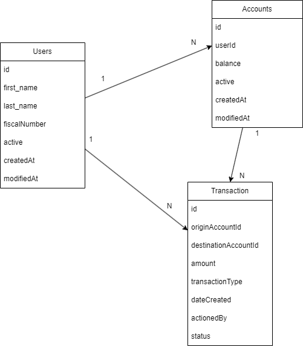

# tiny-bank

In this overly simplist and direct approach to the requirements shared, there were a lot of corners cut that I would've liked to address more with the appropriate time for them.
Striking a balance between the business requirements, and thinking of an extensible solution for future features is not an easy task.
Like suggested I have foregone the decision to add:

- AuthN/AuthZ
- Proper telemetry
- A more elegant solution for flow control, like the Result pattern for the various responses in the API resources, instead of exceptions, which is not at all ideal.
- Validations done on the resources, I would've prefered to extract them into a separate class, a Validator of sorts, for segregation of responsibilities.
- Business Logic surrounding the transactions. Whether it's a deposit, withdrawal or a transfer, and have it in a strategy patterns of sorts so that the service only comunicates with that piece, and the strategy class does the necessary validations and login associated to each type of TransactionType.


My first approach to the problem was to model the data to fulfil the requirements.





Later a skeleton of the API. I would start with OpenApi documents so that we could also think about the possible filters, header, authorization, etc.

```
{

GET /api/v{n}/users?querystring...
GET /api/v{n}/users/{userId}
POST /api/v{n}/users
PUT /api/v{n}/users/{userId}/active            // to deactivate an user

GET /api/v{n}/accounts?querystring...
GET /api/v{n}/accounts/{accountId}
POST /api/v{n}/accounts
PUT /api/v{n}/accounts/{accountId}/active      // to deactivate an account

GET /api/v{n}/transactions
GET /api/v{n}/transactions/{transactionId}
POST /api/v{n}/transactions              // could be a transfer, withdrawal or deposit
}
```